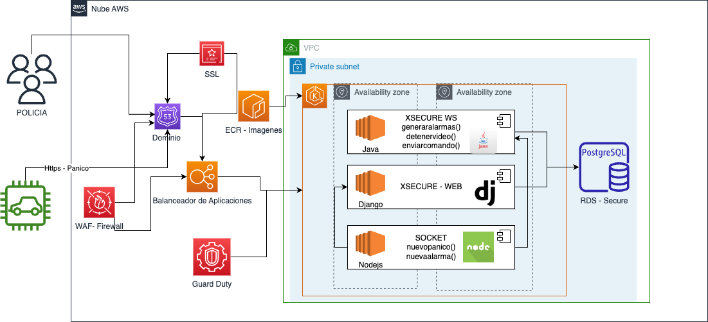

# ARQUITECTURA DE IMPLEMENTACION RECAUDO ELECTRONICO

En esta documentacion se ilustra la arquitectura de implementacion del proyecto de recaudo eletronico y sus diferentes aplicaciones.

## Arquitectura XSecure

La arquitectura refleja los componentes del sistema como se integran y como estan desplegados, notese que los componentes estan desplegas en una red privada y solo se tiene acesso por medio de unas puertas de enla ce especificas.

- WAF: El firewall nos permitira crear ACL para acceso al sistema y mitigar ataques, siguiendo el standar de owas.
- EKS: Cluster que permite desplegar los contendores.
- RDS: se requieren pipeline para desplegar tanto la infraestructura asi como para desplegar en EKS, Lambda y/o s3.
- Guard Duty: Realiza el control sobre ransoware y configuraciones de seguridad.
## Arquitectura para el manejo de devops

El siguiente diagrama ilustra la propuesta para el despliegue de infraestructura y el despliegues continuo de las palicaciones

- Github: Representa el versionador de codigo fuente(puede ser cualquiera basado en git).
- Terraform: Para la construccion de la infraestructura como codigo, de igual manera usara un bucket de s3 para el manejo del estado de la infraestructura.
- Pipeline: se requieren pipeline para desplegar tanto la infraestructura asi como para desplegar en EKS, Lambda y/o s3.

## Arquitectura de referencia
El siguiente diagrama ilustra la arquitectura de referencia propuestas, sugiere los servicios a usar y la forma como deberian interactuar, se intenctan usar la mayor parte de la arquitectura con servicios serverless.

- FrontEnd: Se sugiere desplegarla con s3, tambien se podria utilizar amplify para desplegarlo, en este caso sugerimos un bucket para sitios web estaticos, con el objetivo de usar un servicio serverless y de igual manera en el punto anterior se presento una propuesta de despliegue continuo por tal motivo obviamos amplify, adicionalmente se usara cloudfront para entregar el contenido de la app web.
- Apigateway: Se utilizara para entregar las api de los servicios expuestos ya sea por EKS, lambda, un servicio que aun no se migre del monolito, de igual manera se utilizara la funcion de autorizador para utilizar la autenticacion existente.
- Microservicios: Se orquestaran en kubernetes y adicionalmente los exporadicos se sugiere convertirlos en aws lambdas.
- Eventos: El diagrama muestra los tipos de eventos sugeridos eventbrigde y SNS.
- Cloudwacth: aqui manejaremos los logs.
- Almacenamiento: aqui observamos los 4 tipos de almacenamiento que seran usados dependiendo del caso de uso.
- Seguridad: Se usuara kms para guardar certificados de seguridad, secret manager para los secretos y waf para la seguridad perimetral.

## Conclusiones

El diagrama y la arquitectura se debe complementar al revisar el sistema actual y el roadmap de mejoras.

Al momento de migrar se puede utilizar aws database migrations, de igual manera se puede conseguir un mecanismo de change data capture para en caso de tener una estrategia que libere entregas de valor parciales y no se realice un bigbang y apoyarse en apigateway para que convivan por algun tiempo ambos sistemas.

Por ultimo es importante analizar si ya se tienen otras cuentas en AWS y/o si algun sistema al que se conecte la aplicacion tiene alguna restriccion lo cual nos obligaria a usar manejo especial en las redes.

