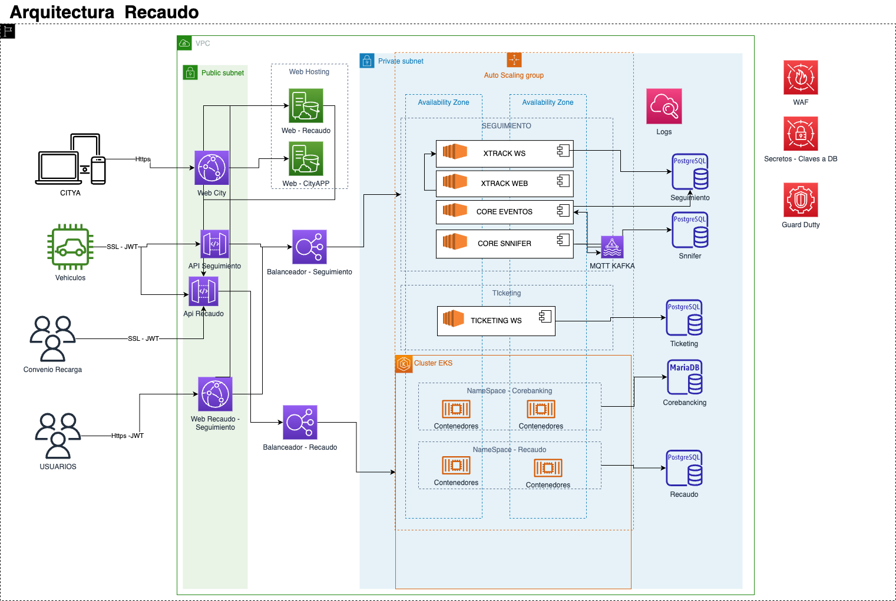

# ARQUITECTURA DE IMPLEMENTACION RECAUDO ELECTRONICO

En esta documentacion se ilustra la arquitectura de implementacion del proyecto de recaudo eletronico y sus diferentes aplicaciones.

## Arquitectura XSecure

La arquitectura refleja los componentes del sistema como se integran y como estan desplegados, notese que los componentes estan desplegas en una red privada y solo se tiene acesso por medio de unas puertas de enla ce especificas.

- WAF: El firewall nos permitira crear ACL para acceso al sistema y mitigar ataques, siguiendo el standar de owas.
- EKS: Cluster que permite desplegar los contendores.
- RDS: Las base de datos se exponen en amazon RDS, con la posisbilidad de desplegarlas en amazon aurora de ser necesario para mejorar la disponibilidad de las mismas.
- Guard Duty: Realiza el control sobre ransoware y configuraciones de seguridad.

## Arquitectura Recaudo
El siguiente diagrama ilustra la arquitectura global del sistema se maneja a manera de arquitectura de solucion por lo cual no describe todas las piezas de codigo.

- WAF: El firewall nos permitira crear ACL para acceso al sistema y mitigar ataques, siguiendo el standar de owas.
- EKS: Cluster que permite desplegar los contendores.
- RDS: Las base de datos se exponen en amazon RDS, con la posisbilidad de desplegarlas en amazon aurora de ser necesario para mejorar la disponibilidad de las mismas.
- Guard Duty: Realiza el control sobre ransoware y configuraciones de seguridad.
- FrontEnd: Se despliega en s3 utilizando cloudfornt para entregar el contenido dinamico.
- Apigateway: Se utilizara para entregar las api de los servicios expuestos ya sea por EKS, lambda y cualquier otro servicio de igual manera se utilizara la funcion de autorizador para utilizar la autenticacion existente.
- Microservicios: Se orquestaran en kubernetes .
- Eventos: Actualmente los eventos se manejan con apache kafka.
- Cloudwacth: aqui manejaremos los logs.
- Almacenamiento: los archivos se alamacenan en s3.
- Seguridad: Se usuara kms para guardar certificados de seguridad, secret manager para los secretos y waf para la seguridad perimetral y guard dutty para reforzar la seguridad.
- Operaciones de venta: utilizamos un mecanismo de apigateway lo que no permite ser flexibles con los operadores de recarga, cumplir con el estandar de OWASP para apis,y nos aseguramos que todas las operaciones sean en linea por medio de internet y utilizando protocolos seguros ssl y jwt, esto implica que no tenga ninguna limitacion a la hora de recargar, pagar y o consultar saldos.

## Conclusiones

Se utiliza el estandar de OWASP para seguir las buenas practicas de arquitecturas seguras, los diagramas son complementarios a los diagramas de arquitectura de software que describen las piezas de codigo y microservicios.

